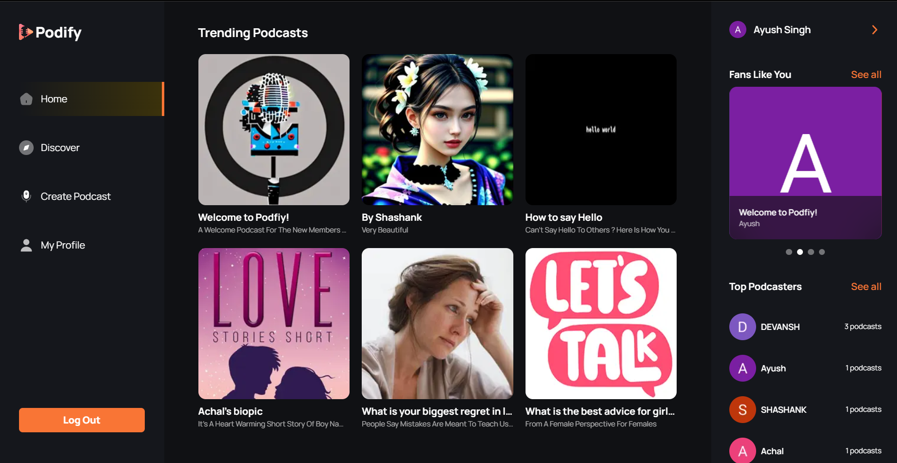
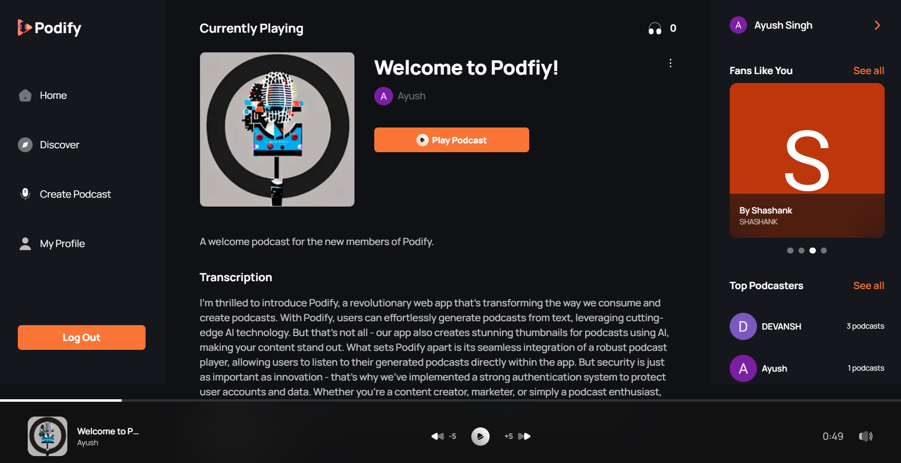

# Podify: AI-Powered Podcast Creating App

## Check It Out

https://podify-beta.vercel.app

## Overview

Podify is an innovative podcast app that leverages AI to generate high-quality podcasts and thumbnails. With a user-friendly interface and robust security features, including OAuth authentication, Podify makes it easy to create and manage your podcasts.

## Features

- AI-generated podcasts and thumbnails
- User-friendly interface for easy podcast creation and management
- Robust security with OAuth authentication

## Screenshots

- ### Login Page:
  
- ### Home Page:
  
- ### Create Podcast Page:
  
- ### Podcast Page:
  
- ### Profile Page:
  

## Tech Stack

1. NextJS
2. Convex + Clerk
3. Stable Diffusion
4. Azure Speech Synthesis

## Run Locally

1. Clone the repository: `git clone https://github.com/Ayush-Singh24/Podify.git`
2. Install dependencies: `yarn install`
3. Setup environment varirables (check `.env.example` file)
4. Start the app: `yarn start`
5. Open [http://localhost:3000](http://localhost:3000) with your browser to see the result.

## Contributing

Contributions are welcome! Please submit a pull request with your changes.
